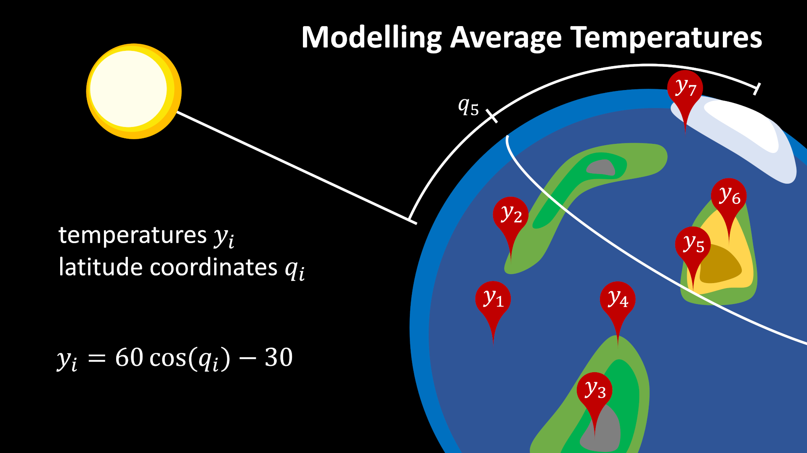
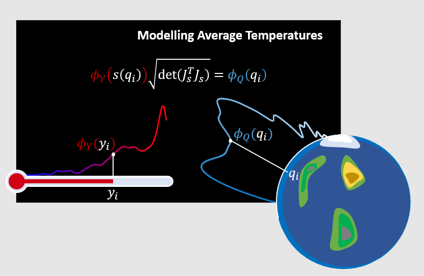
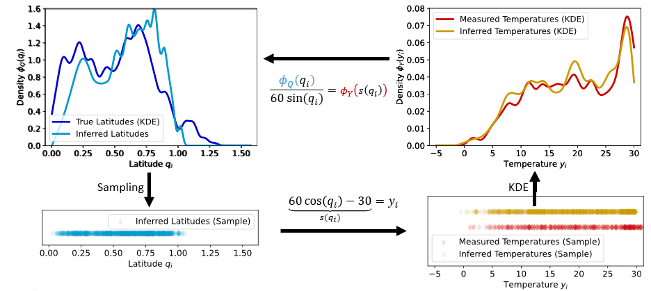

Tutorial
========

This tutorial provides a full walk-through on how to apply EPI to a example problem. We only assume that you already installed :code:`epic`.
The tutorial is divided in four sections:

0. :ref:`Introduction`
1. :ref:`Define your data`
2. :ref:`Define your model`
3. :ref:`Inference and Plotting`

.. note::
    The tutorial is based on the :py:class:`epic.example_models.temperature.Temperature` example model and uses the data in :file:`Data/TemperatureData.csv`.
    Everything needed will be provided in the tutorial.

Let's start!

Introduction
------------

EPI is an algorithm to infere a parameter distribution given a data distribution and a model. The (forward) model describes the mapping from parameter points to data points.
In the following we will look at temperature data over the globe and a model for the dependence of the temperature :math:`y_i` on the latitude :math:`q_i`.

|Fig1|

The goal is to derive the parameter distribution :math:`\Phi_Q` from the data distribution :math:`\Phi_Y`. This is the inverse of what our (forward) model is providing.
To solve the inverse problem, EPI uses the multi-dimension transformation formula:

|Fig2|

In the real world, problems with a known continous data distribution are very sparse. Instead, we often rely on discrete measurements.
EPI start with discrete data points as input and derives a continous distribution using Kernel Density Estimation (KDE) techniques.
From this data distribution the EPI algorithm derives the parameter distribution. To close the cycle between the data and parameters, we can again sample from this distribution and use the forward model to get a discrete distribution of the parameters.

.. It does this using the inverse of the multi-dimensional transformation formula, sampling techniques and the KDE again. 

With this picture in mind, we can start to implement the temperature problem in epic.

Define your data
----------------

Your data needs to be stored in a :file:`.csv` file in the following format:

.. code-block:: text

    datapoint_dim1, datapoint_dim2, datapoint_dim3, ..., datapoint_dimN
    datapoint_dim1, datapoint_dim2, datapoint_dim3, ..., datapoint_dimN
    datapoint_dim1, datapoint_dim2, datapoint_dim3, ..., datapoint_dimN
    ...
    datapoint_dim1, datapoint_dim2, datapoint_dim3, ..., datapoint_dimN

Each of the lines defines a N dimensional datapoint. The :file:`.csv` file will be loaded into an :math:`\mathrm{R}^{M \times N}` numpy matrix in EPIC.

In the following we will use the example data :file:`TemperatureData.csv`. You can download it here: :download:`Download Temperature Data<TemperatureData.csv>`.
It has 455 datapoints with two dimensions each. Nonuniform data are not supported in EPIC.

Define your model
-----------------

Next you need to define your model. The most basic way is to derive from the :py:class:`epic.core.model.Model` base class.

.. literalinclude:: ../../../epic/example_models/temperature.py
  :language: python
  :pyobject: Temperature

Of course, you also need the imports:

.. code-block:: python

    import jax.numpy as jnp
    import numpy as np
    from epic.core.model import ArtificialModelInterface, Model

A model inhereting from :py:class:`~epic.core.model.Model` must implement the methods :py:meth:`~epic.core.model.Model.forward` and :py:meth:`~epic.core.model.Model.jacobian`.
In addition it must provide the methods :py:meth:`~epic.core.model.Model.getCentralParam` and :py:meth:`~epic.core.model.Model.getParamSamplingLimits` to provide the sampling algorithm with sensible starting values and boundary values.
The jacobian is derived analytically here and implemented explicitly.

.. important::
    
    If you use jax_ to calculate the forward evaluation of your model, you can get the jacobian using :code:`jax.jacrev(self.forward)`.
    In all other cases you have to provide the jacobian using your own implementation.

.. note::

    If you define your forward method using jax and as class method, you can also inherit from `JaxModel` and the jacobian will be provided for you.
    Additionally, JaxModel will use the jit compiler to speed up the calculation of your jacobian but also of your forward call.

.. warning::

    Using jit on functions with instance variables is dangerous. You can get false results if the variables change internally and jax does not *see* these changes.

.. note::

    For more possibilities on how to define your model, e.g. using external c++ code, see the :ref:`example section <Example Models>`

.. _jax: https://jax.readthedocs.io/en/latest/index.html

Inference and Plotting
----------------------

Now we can use EPI to infere the parameter distribution and plot the results.

.. code-block:: python

    model = Temperature()
    model.inference(data_path = "TemperatureData.csv")

Depening on the complexity of your model the sampling can take a long time.
Due to this reason, not only the final results but also intermediate sampling results are saved.
You can find them in the folder :file:`Applications/Temperature/`.

.. code-block:: python

    model.plot(plot_type="spyder")
    model.plot(plot_type="standard")

As last step you can plot the results using the builtin plotting functionality.
You can choose betweeen a spyder-web representation and a standard plot.
The standard plot is only working for one or two-dimensional parameters and data.

The final results can be found in the file :file:`Applications/Temperature/OverallSimResults.csv`.

.. note::

    TODO It always annoying to follow tutorials and copy all the code. We provide the tutorial also as jupyter noteboke and python file:
    
    * Jupyter notebook file
    * Python file

.. Preparation
.. -----------

.. Create a folder for your project and  package, if you haven't done it yet.

.. .. code-block:: bash

..     mkdir my_project && cd my_project

.. .. code-block:: bash

..     pip install epic
