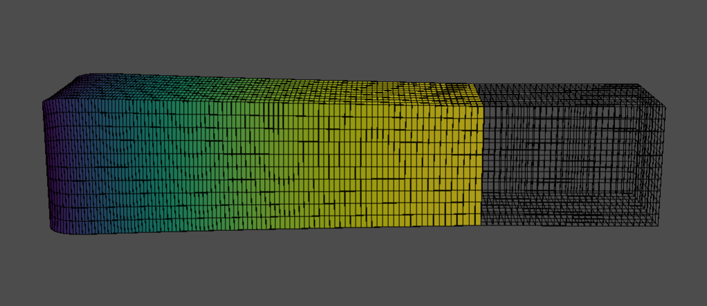

Welcome Sebastian and Vincent! This is the welcome page where we can write something nice about this epic project.
Some math formulas

.. math::
   \psi(r) = e^{-2r} \\
   \frac{dy}{dx} = \pi

an image

or a code block

..  code-block:: python
    :caption: A cute code block

    def epic():
      return True